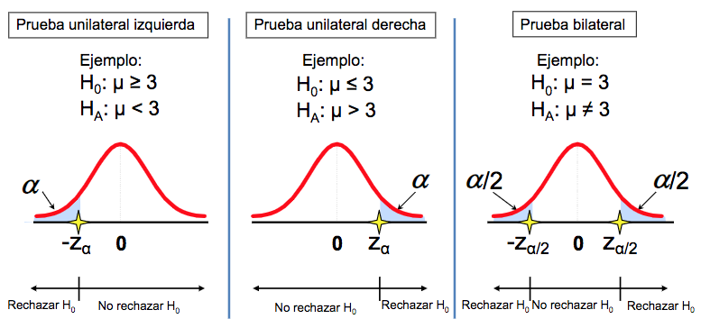

```{r setup, include=FALSE}
knitr::opts_chunk$set(echo = FALSE)
library(ggplot2)
library(UsingR)
library(dplyr)
```

# PLAN DE LA CLASE
**1.- Introducción**
    
- ¿Qué es la inferencia estadística?.   
- ¿Cómo someter a prueba una hipótesis?
- Pruebas paramétricas
- Interpretar resultados de análisis de datos con R.

**2.- Práctica con R y Rstudio cloud**

- Someter a prueba diferentes hipótesis estadísticas.
- Realizar gráficas avanzadas con ggplot2. 

# ¿QUÉ ES LA INFERENCIA ESTADÍSTICA?

**Inferencia estadística :** Son procedimientos que permiten obtener o extraer conclusiones sobre los parámetros de una población a partir de una muestra de datos tomada de ella.


```{r, echo=FALSE, out.width = '100%' }
knitr::include_graphics("Inferencia.png")
```

**¿Qué inferencia puede hacer de los datos de esta población?**  
**¿Qué ocurre si la muestra no es aleatoria?**

# INFERENCIA ESTADÍSTICA

**¿Par qué es importante la inferencia estadística?**  

- **Es más económico que hacer un Censo.**  
  ¿Cuántas especies hay en una bahía, en una laguna, en un bosque? 
  
- **Bajo ciertos supuestos permite hacer afirmaciones.**  
  Con fertilizante A las plantas crecen más que con fertilizante B.  
  
- **Bajo ciertos supuestos permite hacer predicciones.**  
  Mujeres con genotipos mutante del gen BCRA1 tiene 7 veces más probabilidad de tener cáncer ovárico que mujeres con genotipo normal. 
  
# INFERENCIA ESTADÍSTICA: MÉTODOS 

Los métodos de inferencia estadística que revisaremos en este curso son:\
&nbsp;  

1. **Estimación de parámetros a partir de una muestra.**  
Ej. Estimación puntual o por intervalos\
&nbsp;  
2. **Pruebas de contraste de hipótesis.**  
Ej. Pueba de correlación, comparación de medias, Anova.\
&nbsp;  

3. **Modelamiento predictivo.**  
Ej. Regresión lineal, logistica, machine learning, validación cruzada.\
&nbsp;  
  
# PRUEBAS DE HIPÓTESIS

**Objetivo**  
Realizar una afirmación acerca del valor de un parámetro, usualmente contrastando con alguna hipótesis.

**Hipótesis estadísticas**  
*Hipótesis nula* (H~0~) es una afirmación, usualmente de igualdad. 

*Hipótesis alternativa* (H~A~) es una afirmación que se deduce de la observación previa o de los antecedentes de literatura y que el investigador cree que es verdadera.

**Ejemplo**  
**H~0~**: El nivel medio de cortisol es = 15 microgramos por decilitro.  
**H~A~**: El nivel medio de cortisol es > 15 microgramos por decilitro.  

# ¿POR QUÉ DOS HIPÓTESIS?

- Las pruebas estadísticas tienen como propósito someter a prueba una hipótesis nula con la intención de **_rechazarla_** o **refutarla** [(Falsacionismo de Karl Popper)](https://es.wikipedia.org/wiki/Falsacionismo).

- Por lo tanto, los datos nos dirán si **existen o no** evidencias para **rechazar la hipótesis nula**.

**¿Por qué no simplemente aceptar la hipótesis alternativa?**

- Porque pueden existir otros fenómenos no conocidos o no considerados en nuestro experimento que posteriormente permitan a otro investigador rechazar nuestra hipótesis alternativa.	

Lectura complementaria: El método científico según [Juan José Ibáñez, 2006](https://www.madrimasd.org/blogs/universo/2006/10/08/45363)

# ¿CUÁNDO RECHAZAR **H~0~**?

**Regla de decisión**  
Rechazo **H~0~** cuando la evidencia observada es poco probable que ocurra bajo el supuesto de que la hipótesis sea verdadera. 

Generalmente $\alpha$ = 0,05 o 0,01.

Es decir, rechazamos cuando el valor del estadístico está en el 5% inferior de la función de distribución muestral.

# PRUEBA DE HIPÓTESIS: UNA COLA O DOS COLAS

```{r, echo=FALSE, out.width = '100%',fig.align='center'}

```


# ¿PUEDO COMETER UN ERROR EN LAS PRUEBAS DE HIPÓTESIS?

Por supuesto, siempre es posible llegar a una conclusión incorrecta.

**Tipos de errores**  
Tipo I ($\alpha$) y tipo II ($\beta$), ambos están inversamente relacionados.

 **Decisión** |  **H~0~ es cierta** | **H~0~ es falsa** | 
---- | ---- | ---- |
*Aceptamos H~0~* | Decisión correcta | Error tipo II |
*Rechazamos H~0~* | Error tipo I | Decisión correcta |  

# TIPOS DE PRUEBAS ESTADÍSTICAS

Según la forma de la distribución de la variable aleatoria.

1. **Métodos paramétricos**
  * Las pruebas de hipótesis usualmente asumen una distribución normal de la variable aleatoria.
  * Útil para la mayoría de las variables cuantitativas continuas.

2. **Métodos NO paramétricos**
  * Las pruebas de hipótesis no asumen una distribución normal de la variable aleatoria.
  * Útil para todas las variables, incluyendo cuantitativas discretas y cualitativas.


# CORRELACIÓN ENTRE VARIABLES

```{r, echo=FALSE, out.width = '100%',fig.align='center'}
knitr::include_graphics("Correlation.png")
```


# ESTUDIO DE CASO: RELACIÓN ESTATURA PADRES - HIJOS

```{r,message=FALSE, echo=FALSE, out.width = '80%',fig.align='center', fig.cap="Relación estatura de padres e hijos evaluados por Karl Pearson en sus estudios de regresión."}
My_Theme = theme(
  axis.title.x = element_text(size = 18),
  axis.text.x = element_text(size = 18),
  axis.title.y = element_text(size = 18),
  axis.text.y = element_text(size = 18))

ggplot(data = father.son) +
  geom_point(aes(x = fheight, y = sheight),
                     col = 'darkblue',
                     size = 2,
                     alpha = 1/2) + 
  geom_smooth(aes(x = fheight, y = sheight), method = 'lm')+
  labs( x="Estatura padres (Pulgadas)", y="Estatura hijos (Pulgadas)") + My_Theme

```

# HIPÓTESIS PRUEBA DE CORRELACIÓN
**Hipótesis**  
$H_0$ : $\rho$ = 0 ausencia de correlación.      
$H_1$ : $\rho$ $\neq$ 0 existencia de correlación.    

**Supuestos:**  
	1) Las variables X e Y son continuas y su relación en lineal.     
	2) La distribución conjunta de (X,Y) es una distribución Bivariable normal. 
	
#  PRUEBA DE CORRELACIÓN DE PEARSON

```{r, echo=TRUE}
cor.test(father.son$fheight, father.son$sheight)

```

# PRUEBA DE COMPARACIÓN DE MEDIAS

```{r , echo=FALSE, out.width = '80%',fig.align='center'}
knitr::include_graphics("t-student.png")
```

# ESTUDIO DE CASO: CORTIZOL

```{r, out.width = '80%', fig.cap="Nivel de cortisol luego de caminar en zona urbana v/s zona boscosa."}

dat<- data.frame(Zona=rep(c("Urbano", "Bosque"), each=10), Cortisol=c(rnorm(10, 10, 2),rnorm(10, 8, 2)))
 
 My_Theme = theme(
  axis.title.x = element_text(size = 18),
  axis.text.x = element_text(size = 18),
  axis.title.y = element_text(size = 18),
  axis.text.y = element_text(size = 18))


ggplot(dat, aes(x=Zona, y=Cortisol, fill=Zona))+
 geom_boxplot()+
  labs( x="Zona", y="Cortisol (nanogramos / decilitro)") + My_Theme+theme(legend.position='none')

```


[Adaptado de Kobayashi, et al. 2019](https://www.frontiersin.org/articles/10.3389/fpubh.2019.00376/full) 

# HIPÓTESIS COMPARACIÓN DE MEDIAS
**Hipótesis**  
$H_0$ : $\mu_1$ = $\mu_2$.  
$H_1$ : $\mu_1$ $\neq$ $\mu_2$  

**Supuestos**  
1) Las variables X es continua.  
2) Distribución normal.  

# PRUEBA DE T PARA DOS MUESTRAS INDEPENDIENTES

```{r, echo=TRUE}
t.test(Cortisol ~ Zona, dat, alternative = c("two.sided"),
       var.equal=TRUE)
```

# PRÁCTICA ANÁLISIS DE DATOS


```{r, echo=FALSE, out.width = '100%',fig.align='center'}
knitr::include_graphics("testing_hyphotesis.jpeg")
```

# RESUMEN DE LA CLASE

1. **Conceptos básicos de inferencia estadística**  

2. **Conceptos básicos de pruebas de hipótesis**  
    * Hipótesis nula, hipótesis alternativa.\
&nbsp;      
  
3. **Realizar pruebas de hipótesis**
    * Test de correlación.  
    * Test de comparación de medias para 2 muestras independientes.

4. **Realizar gráficas avanzadas con ggplot2**.    