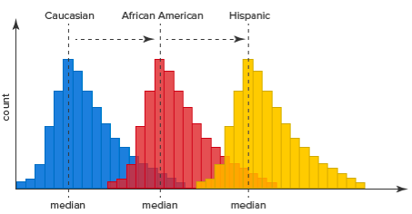

```{r setup, include=FALSE}
knitr::opts_chunk$set(echo = FALSE)
library(ggplot2)
library(tidyr)
library(dplyr)
library(pander) # da formato a tablas estadisticas
library(knitr)
library(FSA) # perform Dunn's Test with Bonferroni correction for p-values
```

# PLAN DE LA CLASE
**1.- Introducción**
    
- ¿Qué son las pruebas no paramétricas?.
- Test de Correlación no paramétrico.
- Pruebas de contraste no paramétrico.
- Prueba de asociación Chi cuadrado.

**2.- Práctica con R y Rstudio cloud**

- Realizar pruebas no paramétricas.  
- Realizar gráficas avanzadas con ggplot2. 

# MÉTODOS NO PARAMÉTRICOS

- Conjunto diverso de pruebas estadísticas.

- El concepto de “no paramétrico” a veces es confuso, pues los métodos no paramétricos si estiman y someten a prueban hipótesis usando parámetros, pero no los de distribución normal.

- Se aplican usualmente para variables cuantitativas que no cumplen con el supuesto de normalidad y para variables categóricas o cualitativas (nominales y ordinales).

- Supuestos: Muestras independientes con idéntica distribución.

# PRUEBA DE CORRELACIÓN NO PARAMÉTRICA

**¿Para que sirve?**    
Para estudiar asociación de dos variables, cuando no se cumple uno o varios supuestos de la correlación paramétrica: 

- Las variables X e Y no son continuas.  
- No existe relación lineal.  
- La distribución conjunta de (X, Y) no es una distribución Bivariable normal.  

```{r, echo=FALSE, out.width = '70%', fig.align='center'}

knitr::include_graphics("Correlacion.png")
``` 

# ESTUDIO DE CASO: FERTILIDAD Y PLOMO

**¿Cuáles son los supuestos que no se cumplen?**  

```{r, out.width = '60%' }

```

[Fuente: Telisman et al. 2000](https://ehp.niehs.nih.gov/doi/epdf/10.1289/ehp.0010845)

# CORRELACIÓN NO PARAMÉTRICA 

- Se basa en calcular el ranking de las variables.
- Calculamos ranking para cada variable.

|  **Plomo sangre (X)** | **Nº espérmios (Y)**| **Ranking X** | **Ranking Y** | 
|:-----:|:-----:|:-------:|:------:|
| 742 | 170 | 4 | 2 | 
| 101 | 180 | 1 | 3 | 
| 313 | 210 | 2 | 4 | 
| 600 | 160 | 3 | 1 | 

|  **Hipótesis** | **Verdadera cuando**| 
|:-------------|:------------------|
| **H~0~**: X e Y mutuamente independientes | $$\rho$$ = 0|
| **H~1~**: X e Y no son mutuamente independientes | $$\rho$$ $$\ne$$ 0|


# COEFICIENTE DE CORRELACIÓN DE SPEARMAN

**¿Cómo se calcula?**   

::: columns

:::: column

**Ranking X ** | **Ranking Y** | $$d$$  | $$d^2$$ |
|:-------:|:------:|:------:|:------:|
| 4 | 2 | 2 | 4 |
| 1 | 3 | -2 | 4 |
| 2 | 4 | -2 | 4 |
| 3 | 1 | 2 | 4 |

::::

:::: column

$$\rho = 1- \frac {6\sum d^2}{n(n^2-1)} = $$ 

$$\sum d^2 = 16$$   

$$\rho = 1- \frac {6*16}{4(4^2-1)} = $$ 

$$rho= -0,6 $$

::::

:::

# PRUEBA DE CORRELACIÓN CON R

```{r, echo=TRUE}
# Crea objetos X e Y 
X <- c(742,101,313,600)
Y <- c(170,180,210,160)

# Realiza test de correlación
cor.test(X,Y, method = "spearman",
         alternative = "two.sided")

```


# COMPARACIÓN DE MUESTRAS INDEPENDIENTES

**¿Para qué sirve?**   
Para comparar dos muestras con idéntica distribución, con diferentes medianas y sin normalidad.

Usualmente para variables discretas.

```{r, echo=FALSE, out.width = '70%' }
knitr::include_graphics("No_par.png")
```

# PRUEBA DE MANN-WHITNEY (W)

Estudio de caso: Formación de biofilm ($\mu m^2$) de *Staphylococcus epidermidis* en presencia de plasma humano. [Adaptado de Skovdal et a. 2021](https://www.ncbi.nlm.nih.gov/pmc/articles/PMC8346721/)

|  **Tratamiento con plasma (T)** | **Control sin plasma (C)**| 
|:----------:|:---------:|
| 9 | 4 |
| 12 | 5 | 
| 13 | 6 | 

|  **Hipótesis** |
|:-------------:|
| **H~0~**: Tratamiento = Control |
| **H~1~**: Tratamiento > Control | 

# CÁCULO ESTADÍSTICO MANN-WHITNEY (W)

**¿Cómo se calcula el estadístico W?**   
Como la diferencia de los ranking entre tratamiento y control

|  **Tratamiento  (T)** | **Control (C)**| **Ranking T ** | **Ranking C** |
|:----------:|:---------:|:--------:|:--------:|
| 9 | 4 | 4 | 1 | 
| 12 | 5 | 5 | 2 | 
| 13 | 6 | 6 | 3 | 
|  |  |  $$\sum$$ = 15 | $$\sum$$ = 6 |

*W* = 15 - 6 = 9  
Máxima diferencia posible entre T y C.


# PRUEBA DE MANN-WHITNEY CON R

```{r, echo=TRUE}
# Crea objetos tratamiento y control
t <- c(9, 12, 13)
c <- c(0, 4, 6)

# Realiza prueba de Mann-Whitney
wilcox.test(t, c, alternative = "g",
            paired = FALSE)
```

# COMPARACIÓN DE MUESTRAS PAREADAS

**¿Para que sirve?**   
Para comparar dos muestras *pareadas* con idéntica distribución, con diferentes medianas y sin normalidad.

```{r, echo=FALSE, out.width = '90%' }
knitr::include_graphics("pareadas.png")
```

# PRUEBA DE WILCOXON MUESTRAS PAREADAS

Estudio de caso: Gonadotrofina en trucha 7 y 14 días [**post ovulación.**](https://hal.inrae.fr/hal-02714224/document)

¿Aumenta la gonadotrofina post ovulación?

|  **Trucha** | **7 días**| **14 días** | $$d$$ |  Ranking con signo |
|:------:|:------:|:------:|:------:|:-------:|
| 1 | 45 | 49 | 4 | **2** |
| 2 | 41 | 50 | 9 | **4** |
| 3 | 47 | 52 | 5 | **3** |
| 4 | 52 | 50 | 2 | **-1** |

W = suma de los ranking = 8  
V = suma de casos positivos (aumenta) = 9

|  **H~0~** | **H~1~** |
|:-------------:|:-------------:|
| d = 0 | d > 0 | 

# PRUEBA DE WILCOXON PAREADAS CON R

```{r, echo=TRUE}
# Crea objetos pre y post
pre <- c(45, 41, 47, 52)
post <- c(49, 50, 52, 50)
# Realiza prueba de Wilcoxon
wilcox.test(post - pre, alternative = "greater")
# no es necesario indicar muestras pareadas
# pues estamos haciendo la resta en la función.

```

# COMPARACIÓN DE MÚLTIPLES MUESTRAS INDEPENDIENTES

**¿Para que sirve?**   
Para comparar múltiples muestras con idéntica distribución, con diferentes medianas y sin normalidad.

```{r, echo=FALSE, out.width = '90%' }

```

# ESTUDIO DE CASO: DAÑO EN PLANTAS DE NOGAL

 [**Besoain. 201**](https://www.redagricola.com/cl/bioinoculante-accion-preventiva-ante-enfermedades-fungicas/). Fertilizante Vitanica® RZ (con *Bacillus amyloliquefaciens*) tiene acción preventiva ante enfermedades fúngicas en nogal.

```{r, echo=FALSE, out.width = '90%' }

```


# PRUEBA DE KRUSKAL - WALLIS CON R

```{r}
# Simula datos acción fúngica
set.seed(1)
data <- data.frame(Tratamientos = rep(c("T0", "T1", "T2", "T3", "T4"), each = 9), IDr = c(runif(9, 0.6,0.8),
            runif(9, 0.1, 0.3),
            runif(9, 0.2, 0.4),
            runif(9, 0.35, 0.45),
            runif(9, 0.05, 0.16)))
data$Tratamientos <- as.factor(data$Tratamientos)
```

|  **Hipótesis** |
|:-------------:|
| **H~0~**: La distribución de los k grupos son iguales. |
| **H~1~**: Al menos 2 grupos son distintos. | 

```{r, echo=TRUE}
# Realiza prueba de kruskal
kruskal.test(IDr ~ Tratamientos, data=data) %>% pander()

```


# PRUEBA DE DUNN PARA COMPARACIONES MULTIPLES

```{r, echo=FALSE, message=FALSE}
# Realiza prueba de dunn
table <- dunnTest(IDr ~ Tratamientos,
         data=data,
         method="bonferroni")
table$res %>% pander(digits=2)

```

# PRUEBA DE ASOCIACIÓN VARIABLES CATEGÓRICAS

**¿Para que sirve?**  
Se utilizan para investigar la asociación de dos o más variables categóricas una de las cuales es una variable respuesta y la otra es una variable predictora.

|  **Tratamiento** | **Respuesta +**| **Respuesta -** | 
|:----|:---|:---|
| Si | a | c | 
| No | b | d | 


# PRUEBA DE CHI CUADRADO

Esta prueba contrasta frecuencias observadas con las frecuencias esperadas de acuerdo con la hipótesis nula.

|  **Hipótesis** |
|:-------------:|
| **H~0~**: La variable predictora y la variable respuesta son independientes (Tratamiento = control) |
| **H~1~**: La variable predictora y la variable respuesta NO son independientes | 

**¿Cómo se calcula el estadístico Chi cuadrado?**   

$$ X^2 = \sum \frac {(freq. obs. - freq. esp.)^2}{(freq. esperada)} = \sum \frac {(O - E)^2}{(E)}$$

# ESTUDIO DE CASO: GERMINACIÓN DE SEMILLAS DE PEUMO

[**Chacon et al. 1998**](http://rchn.biologiachile.cl/pdfs/1998/2/Chacon_et_al_1998.pdf). Germinación depende de tamaño de semilla.

```{r, echo=FALSE, out.width = '80%' }

```

# PRUEBA CHI CUADRADO

```{r, echo=FALSE}
# Crea matriz de datos
datos <- c(13, 23, 26, 17, 7, 4)
dim(datos) <- c(3,2)
rownames(datos) <- c('small','medium',"large")
colnames(datos) <- c('Germinated','No germinated')
```

```{r, echo=TRUE,warning=FALSE}
datos
# Test de Chi-squared en R (chisq.test)
test<-chisq.test(datos, correct = FALSE)

test %>% pander()
```


# PRÁCTICA ANÁLISIS DE DATOS

- Guía de trabajo práctico disponible en Posit.cloud.  
**Clase_07**

# RESUMEN DE LA CLASE

Revisión de conceptos de estadística no paramétrica.  

-  Correlación de Spearman.  
-  Prueba de Man-Whitney.    
-  Prueba de Wilcoxon.  
-  Prueba de Kruskal Wallis + DUNN test.  
-  Prueba de Chi-cuadrado.  
