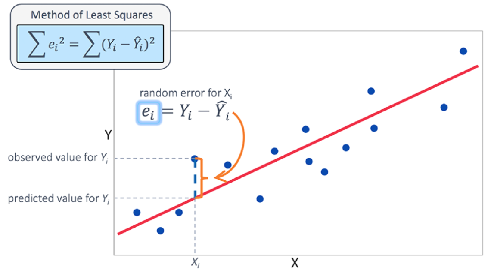
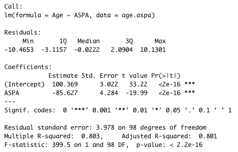

```{r setup, include=FALSE}
knitr::opts_chunk$set(echo = FALSE)
library(readxl)
library(dplyr)
library(ggplot2)
# library(UsingR)
library(ggpmisc)
library(knitr)
library(car)
library(lmtest)
library(gridExtra)
```

# PLAN DE LA CLASE
**1.- Introducción**
    
- ¿Qué son los modelos lineales?
- ¿Qué es y para qué sirve una Regresión lineal?
- Correlación v/s causalidad.
- Ecuación de regresión lineal: betas.
- Interpretación Regresión lineal con R.
- Evaluación de supuestos.

**2.- Práctica con R y Rstudio cloud**

- Realizar análisis de regresión lineal.
- Realizar gráficas avanzadas con ggplot2. 
- Elaborar un reporte dinámico en formato html.  

# MODELOS LINEALES 

Los modelos lineales se usan para explicar, modelar o predecir la relación lineal de una variable respuesta $Y$ con una o más P variables predictoras $X_1, X_2,... X_P$               . 

$Y = \beta_{0} + \beta_{1} X_{1} + \beta_{2} X_{2} + ....  \beta_{p} X_{p} +\epsilon_i$

Si p=1, regresión lineal simple.  
Si = >1 regresión lineal múltiple.  
Si p> 1 y existe una variable categórica, se lama ancova.  

# ESTUDIO DE CASO: METILACIÓN GEN ASPA Y EDAD

Gen ASPA: Codifica la enzima Aspartoacilasa.
Variable respuesta: Edad en años.
Variable predictora: % de metilación gen ASPA.
```{r}
age.aspa <- read_excel("age.aspa.xlsx")
head(age.aspa)
```
[Fuente: Adaptado de Huang et al. 2015](Fuente: https://doi.org/10.1016/j.fsigen.2015.05.007)

# REGRESIÓN LINEAL SIMPLE

Herramienta estadística que permite determinar si existe una relación (asociación) entre una variable predictora (independiente) y la variable respuesta (dependiente).

```{r, echo=FALSE, out.width = '75%', message=FALSE, fig.align='center'}

formula1 <- y ~ x

My_Theme = theme(
  axis.title.x = element_text(size = 20),
  axis.text.x = element_text(size = 20),
  axis.title.y = element_text(size = 20),
  axis.text.y = element_text(size = 20))


q <- age.aspa %>% ggplot(aes(x = ASPA, y = Age)) + 
   geom_point() +
   stat_smooth(method = "lm", col = "blue", show.legend=TRUE) + scale_x_continuous(n.breaks = 8)
q+My_Theme+ggtitle("Relación edad - % metilación gen ASPA.") 
```


# ECUACIÓN DE REGRESIÓN LINEAL: BETAS

$Y = \beta_{0} + \beta_{1} X_{1} + \epsilon$

**Betas** miden la influencia del intercepto y la pendiente sobre la variable $Y$.

$\beta_{0}$ =  Intercepto = valor que toma “y” cuando x = 0.

$\beta_{1}$ = Pendiente =  Cambio promedio de “y” cuando “x” cambia en una unidad.

$\epsilon$ = mide la variabilidad de la variable respuesta que no es explicada por la recta de regresión.

# LINEA DE REGRESIÓN

**Línea de regresión**: Corresponde a los valores “ajustados” o estimados
de “y” en función de “x”. Se calcula con los estimadores de *mínimos cuadrados* de $\beta_{0}$ y $\beta_{1}$.

```{r, echo=FALSE, out.width = '75%', message=FALSE, fig.align='center'}
age.aspa <- read_excel("age.aspa.xlsx")
formula1 <- y ~ x

My_Theme = theme(
  axis.title.x = element_text(size = 20),
  axis.text.x = element_text(size = 20),
  axis.title.y = element_text(size = 20),
  axis.text.y = element_text(size = 20))


q <- age.aspa %>% ggplot(aes(x = ASPA, y = Age)) + 
   geom_point() +
   stat_smooth(method = "lm", col = "blue", show.legend=TRUE)+  stat_poly_eq(aes(label = paste0("atop(", ..eq.label.., ",", ..rr.label.., ")")), formula = formula1, parse = TRUE, size = 8, label.x.npc = "right") + scale_x_continuous(n.breaks = 8)
q+My_Theme
```

# RESIDUOS Y MÉTODOS DE MÍNIMOS CUADRADOS

```{r, echo=FALSE, out.width = '100%' }

```

# COEFICIENTE DE DETERMINACIÓN

**$R^2$** mide la proporción de la variación muestral de “y” que es explicada por x (varía entre 0-1). Se calcula como el cuadrado del coeficiente de correlación de pearson.

```{r, message=FALSE, out.width = '80%' }
dat <- read_excel("dat_cor.xlsx")
formula1 <- y ~ x

My_Theme = theme(
  axis.title.x = element_text(size = 20),
  axis.text.x = element_text(size = 20),
  axis.title.y = element_text(size = 20),
  axis.text.y = element_text(size = 20))


a <- dat %>% ggplot(aes(x = A, y = B)) + 
   geom_point() +
   stat_smooth(method = "lm", col = "blue", show.legend=TRUE)+  stat_poly_eq(aes(label = paste0("atop(", ..rr.label..,")")), formula = formula1, parse = TRUE, size = 8, label.x.npc = "left") + scale_x_continuous(n.breaks = 8)+My_Theme

b <- dat %>% ggplot(aes(x = A, y = C)) + 
   geom_point() +
   stat_smooth(method = "lm", col = "blue", show.legend=TRUE)+  stat_poly_eq(aes(label = paste0("atop(",..rr.label..,")")), formula = formula1, parse = TRUE, size = 8, label.x.npc = "left") + scale_x_continuous(n.breaks = 8)+ My_Theme

grid.arrange(a, b, ncol=2, nrow =1)
```

# PRUEBAS DE HIPÓTESIS

**_Prueba de hipótesis del coeficiente de regresión y el intercepto_**
**Tipo de prueba**: Prueba de t – student  

La hipótesis nula en ambos casos es que los coeficiente ($\beta_0$) y ($\beta_1$) son iguales a 0.

$H_0:\beta_0 = 0$ y $H_0:\beta_1 = 0$

**_Prueba de hipótesis del modelo completo_**
**Tipo de prueba**: Prueba de F.

La hipótesis nula es que los coeficientes son iguales a 0.

$H_0:\beta_j = 0$ ; $j = 1, 2,...,k$

Un Beta significativo indica que X esta correlacionado con Y, pero no necesariamente es un indicador de causalidad.


# REGRESIÓN LINEAL CON R: COEFICIENTES

**reg <- lm(Age~ ASPA, < data = age.aspa)**
**summary(reg)**

```{r, echo=F, warning=FALSE, message=FALSE, out.width = '70%'}
reg <- lm(Age ~ ASPA, data = age.aspa)
```

```{r, echo=F, warning=FALSE, message=FALSE, out.width = '100%'}

```

# REGRESIÓN LINEAL CON R: PRUEBA DE F

Anova de la regresión.
```{r, echo=TRUE}
anova(reg)
```


# SUPUESTOS DE LA REGRESIÓN LINEAL SIMPLE

- ¿Cuales son los supuestos?  
Independencia.  
Linealidad entre variable independiente y dependiente.  
Homocedasticidad.  
Normalidad.  

- ¿Por qué son importantes?  
Para validar el resultado obtenido.  
En caso de incumplimiento se pueden transformar datos o elaborar otros modelos (Regresión logística).  


# INDEPENDENCIA: MÉTODO GRÁFICO

**H~0~**: Los residuos son independientes entre sí.

**H~A~**: Los residuos no son independientes entre sí (existe autocorrelación). 

```{r, echo=TRUE,out.width = '70%', fig.align='center'}
plot(reg$residuals)
abline(h=0, col="red")

```

# LINEALIDAD: MÉTODO GRÁFICO

**H~0~**: Hay relación lineal entre la variable regresora y la variable predictora.

**H~A~**: No hay relación lineal entre la variable regresora y la variable predictora.  
```{r, echo=FALSE,out.width = '80%', fig.align='center'}
plot(age.aspa$ASPA,age.aspa$Age, xlab="Metilación gen ASPA", ylab = "Edad")
```


# HOMOGENEIDAD DE VARIANZAS: MÉTODO GRÁFICO

**H~0~**: La varianza de los residuos es constante.

**H~A~**: La varianza de los residuos no es constante.

```{r, echo=TRUE,out.width = '80%', fig.align='center'}
plot(reg, which=3)
```

# NORMALIDAD: GRÁFICO DE CUANTILES

**H~0~**: Los residuos tienen distribución normal.  
**H~A~**: Los residuos no tienen distribución normal.  
 

```{r, echo=TRUE,out.width = '80%', fig.align='center'}
qqPlot(reg) # library(car)
```

# VALORES ATÍPICOS
Una observación se puede considerar influyente (valor atípico) si tiene un valor de distancia de Cook mayor a 1. 

```{r, echo=TRUE,out.width = '80%', fig.align='center'}
plot(reg, which=4)
```


# PRÁCTICA ANÁLISIS DE DATOS

- Guía de trabajo práctico disponible en Posit.cloud. clase 08.  


# RESUMEN DE LA CLASE

- Elaborar hipótesis para una regresión lineal.

- Realizar análisis de regresión lineal simple.

- Interpretar coeficientes.

- Evaluar supuestos de los análisis de regresión (util para anova).
