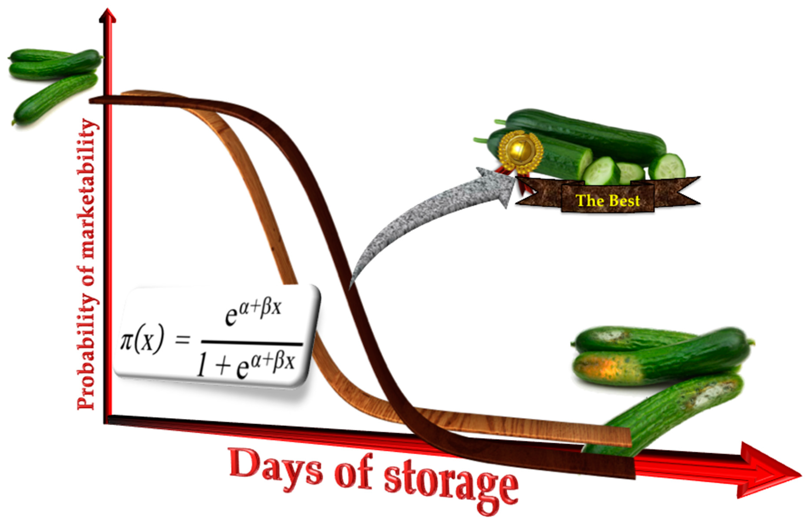
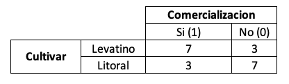

```{r setup, include=FALSE}
knitr::opts_chunk$set(echo = FALSE)
library(car)
library(lmtest)
library(psych)
library(readxl)
library(nlme)
library(lme4)
library(stats)
library(boot)
library(readxl)
library(dplyr)
library(ggplot2)
library(ggpmisc)
library(knitr)
library(car)
library(lmtest)
library(psych)
library(gridExtra)
library(nortest)
# library(sjPlot)
library(lme4)
library(reshape2)
```

# **PLAN DE LA CLASE**

**1.- Introducción**
    
- Regresión logística ¿Qué es y para que sirve?

- Ejemplo de modelo de regresión logística.

- Interpretación de regresión logística con R.

**2.- Práctica con R y Rstudio cloud**

- Ajustar modelos de regresión logística.

- Realizar gráficas avanzadas con ggplot2.

# **REGRESIÓN LOGÍSTICA**

- La regresión logística es una técnica de modelamiento predictivo en la cual la probabilidad de un evento se relaciona con una o más variables predictoras.

- Las principales supuestos del modelo de regresión logística son:

a) variable respuesta de tipo binaria: Sano o enfermo, maduro o no maduro, macho o hembra, germina o no germina, Venta de un producto (si/no).

b) Independencia: las observaciones deben ser independientes.

c) Multicolinealidad: se requiere de muy poca a ninguna multicolinealidad entre los predictores (para regresión logística múltiple).

d) Linealidad: entre la variable independiente y el logaritmo natural de odds **(Cociente de chances)**.

# **ECUACIÓN DE LA REGRESIÓN LOGÍSTICA**

- Modelo de regresión logística en formato lineal:

$$log (\frac{p}{1-p}) = \beta_0 + \beta_1X_1$$

- Forma de calcular la probabilidad de que el evento éxito ocurra dada la variable predictora considerada:

$$p(Y=1|X_1) = \frac{e^{\beta_0 + \beta_1X_1}}{1 + e^{\beta_0 + \beta_1X_1}}$$

- Modelo de regresión logística múltiple en formato lineal:

$$log (\frac{p}{1-p}) = \beta_0 + \beta_1X_1 + \beta_2X_2 +... + \beta_pX_p$$
# **ESTUDIO DE CASO: COMERCIALIZACIÓN DE PEPINO**

[Díaz-Pérez et al. 2018](https://www.mdpi.com/2073-4395/9/1/17) comparan la probabilidad de comercialización (variable respuesta binaria) de diferentes cultivares de pepino respecto del tiempo de almacenamiento.

```{r, echo=FALSE, out.width = '60%', fig.align='center'}

```

# **COCIENTE DE CHANCES**

- COCIENTE DE CHANCES = ODDS RATIO

- Supongamos que tomamos una muestra de 20 pepinos de 2 cultivares diferentes luego de 20 días de almacenamiento y comparamos si se pueden comercializar (Si o No) con base a diferentes criterios de calidad. 

- ¿Qué cultivar tiene mayor chance de ser comercializado?
- ¿Cuál es la chance de comercialización de un cultivar respecto de otro?

```{r, echo=FALSE, out.width = '60%', fig.align='center'}

```


# **CALCULO DE CHANCES**

```{r, echo=FALSE, out.width = '60%', fig.align='center'}

```

- Primero calculamos la chanche en Levantino.

a) $P_C(Comercialización) = 7/10 = 0.7$

b) $P_NC(No comercialización) = 1- P_C = 1-0.7=0.3$

c) $odds_CLevantino = P_C/P_NC= 0.7/0.3= 2.333$

- Calcule usted la chanche en Litoral.


# **CALCULO DE CHANCES**

- Calculamos la chance de comercialización en Litoral.

a) $P_C(Comercialización) = 3/10 = 0.3$  

b) $P_NC(No comercialización) = 1 - P_C = 1-0.3=0.7$  

c) $odds_CLitoral = P_C/P_NC= 0.3/0.7 = 0.429$  

*Calcular el cociente de chances (Odds Ratio)*

- ¿Cuál es la chance de comercialización de los Levantino respecto de las Litoral?

$$OR = odds_CLevantino/odds_CLitoral= 2.333/0.429 = 5.44$$

# **ESTUDIO DE CASO: COMERCIALIZACIÓN DE PEPINO**

- En este estudio de caso trabajaremos con un conjunto de datos simulados a partir del trabajo de [Díaz-Pérez et al. 2018](https://www.mdpi.com/2073-4395/9/1/17). 

|  **Variable** | **Descripción**| 
|:-------------|:------------------|
| **Tiempo de almacenamiento** | Nº días |
| **Comercializacion** | (1: Si) o (0: No) |
| **Tipo de cultivar** | Levantino o Litoral |

- Determinaremos si la probabilidad de comercialización está relacionada con los días de almacenamiento y compararemos el resultado entre ambos cultivares. 
- Como tarea usted evaluará probabilidad de maduración en función del genotipo del pez (gen Vgll3 de maduración).

```{r, echo=FALSE}
maduracion <- read_excel("Maturation.xlsx")
maduracion$Genotype <- as.factor(maduracion$Genotype)
maduracion <- maduracion%>% 
              select("Fish","Genotype","Gonad","GSI","Maturation")
mod_logit <- glm(Maturation ~ Gonad, 
                family= binomial, data = maduracion)
```

# **RELACIÓN MADURACIÓN VS PESO DE GÓNADA**

```{r, message=FALSE, warning=FALSE}

My_Theme = theme(
  axis.title.x = element_text(size = 20),
  axis.text.x = element_text(size = 20),
  axis.title.y = element_text(size = 20),
  axis.text.y = element_text(size = 20))

p<- ggplot(data = maduracion, aes(x = Gonad, y = Maturation)) +
  geom_point(aes(color = as.factor(Maturation)), shape = 1) + 
  theme(axis.text.x = element_text(size = 10,face="bold",colour="black"))+
  theme(axis.text.y = element_text(size = 10,face="bold",colour="black"))+
  theme_bw()  +
  labs(x= "Peso de gónada", y = "Maduración")+
  theme(legend.position = "none")+ 
  theme(panel.border=element_blank(), axis.line=element_line())
p+My_Theme
```

# **REGRESIÓN LOGÍSTICA SIMPLE**

```{r, echo=TRUE}
mod_logit <- glm(Maturation ~ Gonad, 
                family= binomial, data = maduracion)
summary(mod_logit)$coef %>% kable()
```

# **PREDICCIÓN REGRESION LOGÍSTICA**

```{r,message=FALSE, warning=FALSE}
# Representación gráfica del modelo.
s <- ggplot(data = maduracion, aes(x = Gonad, y = Maturation)) +
  geom_point(aes(color = as.factor(Maturation)), shape = 1) + 
  theme(axis.text.x = element_text(size = 10,face="bold",colour="black"))+
  theme(axis.text.y = element_text(size = 10,face="bold",colour="black"))+
  geom_hline(aes(yintercept=0.50), color="red")+ 
  stat_function(fun = function(x){predict(mod_logit,
                                          newdata = data.frame(Gonad = x),
                                          type = "response")}) +
  theme_bw() +
  labs(title = "Regresión logística", x="Peso de gónada",
       y = "Probabilidad de Maduración") +
  theme(legend.position = "none")+
  theme(panel.border=element_blank(), axis.line=element_line())
s+My_Theme
```

# **PREDICCIÓN MADURACIÓN**

- Usando la ecuación podemos predecir probabilidad de madurar a un peso de gónada determinado 4g. v/s 8g. 

```{r, echo=FALSE}
#Predecir si un salmón madura o no para un peso de gónada de 4
Prob.mad_4 <- data.frame(Gonad=4)
Prediccion_logis_4 <- predict(mod_logit, Prob.mad_4, type = "response")
Prediccion_logis_4 <- data.frame(Prediccion_logis_4)
colnames(Prediccion_logis_4) <- c("Probabilidad de maduración")

#Predecir si un salmón madura o no para un peso de gónada de 8
Prob.mad_8 <- data.frame(Gonad=8)
Prediccion_logis_8 <- predict(mod_logit, Prob.mad_8, type = "response")
Prediccion_logis_8 <- data.frame(Prediccion_logis_8)
colnames(Prediccion_logis_8) <- c("Probabilidad de maduración")

Peso_Gonada <- c(4,8)
tabla1 <- rbind(Prediccion_logis_4,Prediccion_logis_8)
tabla <- data.frame(Peso_Gonada,tabla1)
colnames(tabla) <- c("Peso de Gónada", "Predicción")
rownames(tabla) <- NULL
kbl(tabla,align='cccc',
    linesep=c("","","","","",""), 
    caption = "Predicciones de maduración según el peso de la gónada.")
```

# **COCIENTE DE CHANCES (ODDS RATIO) CON R**

- **El cociente de chances (OR)**

```{r, echo=TRUE, warning=FALSE, message=FALSE, error=FALSE}
OR_def <-exp(cbind(OR = coef(mod_logit), 
                     confint(mod_logit)))

OR_def %>% kable(digits = 3)

```


# **RESUMEN DE LA CLASE**

**1).** Revisión de conceptos: regresión logística.

**2).** Cociente de chances - Odd Ratio.

**3).** Construir y ajustar modelos de regresión logística con R.

**4).** Gráficas avanzadas con ggplot2.

    